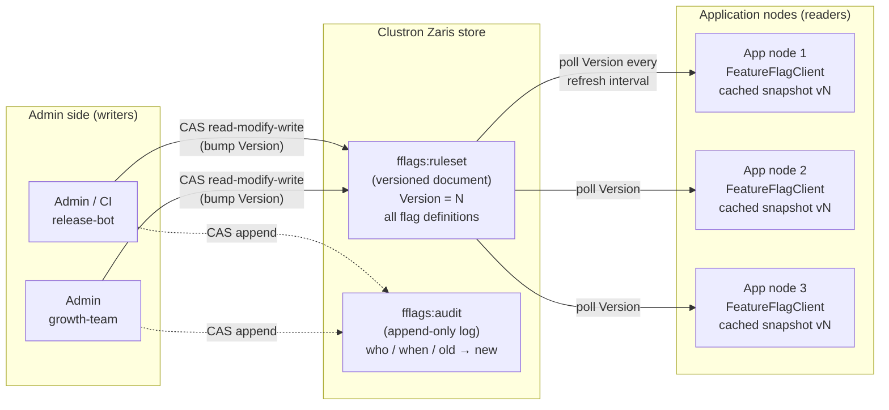
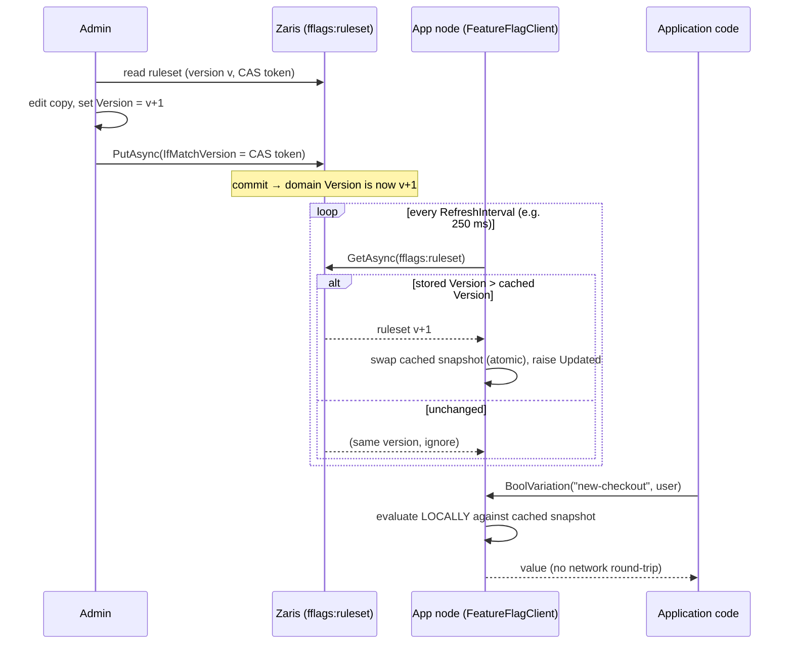

# Feature Flags & Dynamic Configuration on Clustron Zaris

A real, working **feature-flag + dynamic-configuration service** — a mini LaunchDarkly — backed by
[Clustron Zaris](https://clustron.io) (a .NET 8 distributed in-memory KV store).

It lets you change application behaviour **without a redeploy**: define boolean / multivariate /
numeric flags, target them with per-user and segment rules, roll them out to a deterministic,
**sticky** percentage of your user base, and have those changes land on **every running client within
a bounded delay** — no restart. Every change is applied with **optimistic concurrency** so two admins
editing at once never clobber each other, and every change is recorded in an **audit trail**.

> **Self-contained.** The whole thing runs against an embedded, in-process Zaris engine — no external
> cluster, no ports, no config. `dotnet test` and `dotnet run` work out of the box. The *same code*
> runs against a networked cluster by changing one connection string.

---

## The problem

Shipping a code change to turn a feature on, dial a limit, or start an experiment is slow and risky.
Teams want to:

- **Flip behaviour at runtime** — turn a feature on/off, change a config value, kill a misbehaving
  code path — in seconds, without a deploy and without restarting anything.
- **Roll out gradually and *consistently*** — expose a new feature to 1% → 5% → 20% → 100% of users.
  The hard part is *consistency*: the **same** user must stay in (or out) across every evaluation and
  across every server, the percentage must be accurate across the whole population, and widening the
  rollout must never kick anyone back *out* (that causes flapping UIs and corrupt experiment data).
- **Target precisely** — "enterprise accounts in the US", "this one beta user", "staff only".
- **Edit safely and auditably** — multiple admins, no lost updates, a record of who changed what.
- **Evaluate fast and offline-tolerant** — a flag check is on the request hot path; it must be a
  local, in-memory computation, not a network round-trip, and must keep working if the store blips.

This service delivers all of that on top of Zaris's single durable primitive: a **versioned document
with compare-and-swap**.

---

## Architecture



**Propagation + evaluation flow** for a single flag change:



### Projects

| Project | What it is |
|---|---|
| `src/FeatureFlags.Core` | The service: model, pure evaluator, admin (write side), client SDK (read side), Zaris infrastructure. |
| `src/FeatureFlags.Demo`  | A console driver that demonstrates all four scenarios end-to-end and prints evidence. |
| `tests/FeatureFlags.Tests` | 40 xUnit tests (unit + integration) against the **real** embedded Zaris store. |

### Key types

- **`FlagDefinition`** — a self-contained, serializable flag: kind (`Bool`/`String`/`Number`),
  variations, on/off switch, off-variation, prerequisites, explicit targets, ordered targeting rules,
  and a fallthrough (fixed variation *or* a rollout).
- **`RulesetDocument`** — the single document holding **all** flags plus a monotonic `Version`.
- **`FlagEvaluator`** — pure, no-I/O evaluation (`off → prerequisites → targets → rules → fallthrough`).
- **`Bucketing`** — deterministic consistent-hash (SHA-1) bucketing for sticky percentage rollouts.
- **`FeatureFlagAdmin`** — the write side: all mutations via CAS, with audit append.
- **`FeatureFlagClient`** — the read side SDK: caches a snapshot, polls for version bumps, evaluates
  locally, exposes `BoolVariation` / `StringVariation` / `NumberVariation` / `Evaluate`.

---

## Exactly how Zaris is used

The service relies only on **verified** Zaris client capabilities. There is deliberately **no**
dependency on server-side increment, prefix scan, native pub/sub, or multi-key transactions.

### 1. A versioned ruleset document (the index)

All flags live in **one** document at key `fflags:ruleset`. Reading one key returns the entire flag
set, so clients never need a prefix scan (Zaris has none) — **the document is the index of flags**.
The document carries a monotonically increasing `Version` that is bumped on every change.

### 2. Optimistic versioned CAS for every write (no lost updates)

Zaris has no atomic increment, so correctness comes from **compare-and-swap**. Every write:

```csharp
var cur = await client.GetAsync<byte[]>("fflags:ruleset");   // value + cur.Version (CAS token)
// … deserialize, edit a private copy, bump domain Version …
var put = await client.PutAsync("fflags:ruleset", bytes,
             new PutOptions { IfMatchVersion = new ItemVersion(cur.Version.Version) });
if (put.Status == KvStatus.Conflict) { /* someone else committed first → re-read & retry */ }
```

`FeatureFlagAdmin.ApplyAsync` wraps this in a retry loop: on `Conflict` it **re-reads the winner's
committed state and re-applies the edit on top**, so two admins editing concurrently both land — the
demo flips 25 flags from 25 connections at once with **0 lost updates**. First-time creation uses
`PutOptions.IfAbsent = true` (create-once).

### 3. Live propagation by version-polling

Native pub/sub is **not** exposed on the Zaris client (it is RESP-only), so the SDK propagates changes
by **polling the ruleset document's `Version`** on a timer (default 250–500 ms). When the stored
version exceeds the cached version, the client swaps in a fresh immutable snapshot (a single atomic
reference assignment) and raises an `Updated` event. This is a correct, honest, bounded-delay
live-propagation mechanism:

- A change reaches **every** running client within **one refresh interval** — no restart, no manual
  cache-bust.
- A poll reads **one key** regardless of how many flags exist.
- Idle polling adopts nothing (the version hasn't moved), so there is no churn.

> If you deploy against a networked Zaris cluster and want push instead of poll, the same
> `RefreshAsync()` can be triggered from a RESP keyspace-notification subscription — the evaluation
> and snapshot-swap logic is identical. Polling is the self-contained default.

### 4. Local, offline-tolerant evaluation

Clients evaluate against the **cached snapshot only** — a flag check is a fast in-memory computation
with no per-evaluation network call. Before the first load, or during a store blip, the client keeps
the last good snapshot (or `RulesetSnapshot.Empty`), and every evaluation falls back to the
caller-supplied default. The app never blocks on the store to make a decision.

### 5. Audit trail appended via CAS

Each change appends an `AuditEntry` (seq, timestamp, actor, flag, action, **old → new**, resulting
ruleset version) to a single append-only document at `fflags:audit`, using the same CAS
read-modify-write. Concurrent appends never lose an entry — a losing appender re-reads the log (now
containing the other admin's entry) and appends on top, keeping the sequence gap-free.

### 6. TTL at write time

Writes can attach a TTL via `PutOptions.Metadata.Ttl` (set at write time, never via a separate
`ExpireAsync` — a known InProc bug). The infrastructure exposes it on every write for short-lived
records (e.g. ephemeral overrides); the core ruleset and audit documents are durable and untimed.

### Deterministic, sticky percentage rollouts

A rollout partitions the `[0,1)` hash space into weighted buckets. A user's bucket value is
`SHA-1("{flagKey}.{salt}.{userKey}")` mapped into `[0,1)` (first 60 bits / 2⁶⁰ — the LaunchDarkly
scheme). Because it depends only on the flag key, salt and user key:

- **Deterministic & consistent** — every client computes the same value; no server state, no clock.
- **Sticky** — a user keeps the same assignment across evaluations forever.
- **Accurate** — SHA-1 is well-distributed, so 20% of a large population hash below `0.20`.
- **Monotonic** — the "on" bucket is kept first, so *increasing* the percentage only *adds* users;
  nobody already rolled-in ever drops out (no flapping, clean experiment data).

---

## How to run

Prerequisites: **.NET 8 SDK or newer**. The `Clustron.Zaris.*` 2.0.1 client packages (and everything else)
resolve from nuget.org automatically (see `nuget.config`).

```bash
cd E:\Personal\projects\zaris-solutions\feature-flags

# Run the 40 tests (unit + integration, against the real embedded Zaris store)
dotnet test

# Run the end-to-end demonstration
dotnet run --project src/FeatureFlags.Demo
```

The demo spins up one admin and three "app node" clients over a single in-process store and walks
through: defining flags, targeting + multivariate evaluation, a live flip (with measured propagation
latency), a 20%→50% sticky rollout over 50,000 users, 25 concurrent admin edits, and the audit trail.

---

## Observed results

From a representative `dotnet run --project src/FeatureFlags.Demo` (numbers vary slightly per run):

**Targeting + multivariate evaluation** (local, no network per check):

```
homepage-banner for alice (US/pro)         => "holiday"       (reason: RuleMatch)
homepage-banner for bjorn (SE/free)        => "control"       (reason: Fallthrough)
homepage-banner for corp (DE/enterprise)   => "blackfriday"   (reason: RuleMatch)
```

**Live flip propagation** — admin flips a flag; time until all three nodes observe it:

```
Before flip: node-1=False, node-2=False, node-3=False
>>> admin flipped new-checkout ON (ruleset is now v4); nodes poll every 250 ms...
After flip:  node-1=True, node-2=True, node-3=True
>>> propagated to ALL 3 nodes in ~182 ms (bounded by the 250 ms refresh window).
```

**Percentage rollout** — deterministic, consistent across nodes, sticky when widened:

```
20% rollout over 50,000 users:
   node-1 admitted 9,910  = 19.82%
   node-1 vs node-3 disagreements: 0   (deterministic => identical on every node)
Widened 20% -> 50%:
   now admitted 25,085 = 50.17%
   users who were in at 20% but dropped out at 50%: 0   (sticky => expected 0)
```

**Concurrent admin edits** — 25 admins, 25 flags, at once:

```
flags actually enabled: 25/25   (lost updates: 0)
ruleset version advanced by exactly 25 (one commit per edit).
```

**Audit trail** — every change recorded with old → new:

```
#52  v52  21:16:13 admin-20   toggle   exp-20   Enabled=False -> Enabled=True
```

The test suite independently asserts these properties with tolerances:

- Rollout distribution within **±1.5 points** of target at 5% / 20% / 50% over 20,000 users.
- Per-user stickiness across repeated evaluations.
- Monotonic (proper-subset) growth when the percentage is increased (10% ⊂ 20% ⊂ 60%).
- Three-way weighted multivariate split (50/30/20) within tolerance.
- Every clause operator (`In`, `NotIn`, `Contains`, `StartsWith`, `GreaterThan`, `LessThan`,
  `Matches`), rule ordering, prerequisite satisfaction/failure/cycle-guard, and defaulting.
- CAS lost-update prevention and gap-free audit under 25–50 concurrent writers.
- Live flip + rollout change observed by multiple independent client instances with 0 disagreements.

```
Passed!  - Failed: 0, Passed: 40, Skipped: 0, Total: 40
```

---

## Design notes & honest limitations

- **Polling, not push.** Propagation latency is bounded by the refresh interval (configurable;
  250 ms in the demo, 100 ms in tests). This is the self-contained, dependency-free choice. A
  push upgrade (RESP keyspace notifications triggering `RefreshAsync`) would cut the latency without
  changing any evaluation logic.
- **One ruleset document.** Simple, atomic, and the natural index — but it means every change
  serialises through one document's CAS version. That is exactly what makes concurrent edits safe,
  and it comfortably handles hundreds of flags; a very large flag estate would shard the ruleset by
  flag-group across several documents (each independently versioned and polled).
- **Evaluation is pure and client-local**, so it is trivially testable and offline-tolerant, and the
  server is never on the request hot path.
- Runs embedded by default; point the connection string at `zaris://host:port/<store>` to run the
  identical code against a networked cluster.
```
