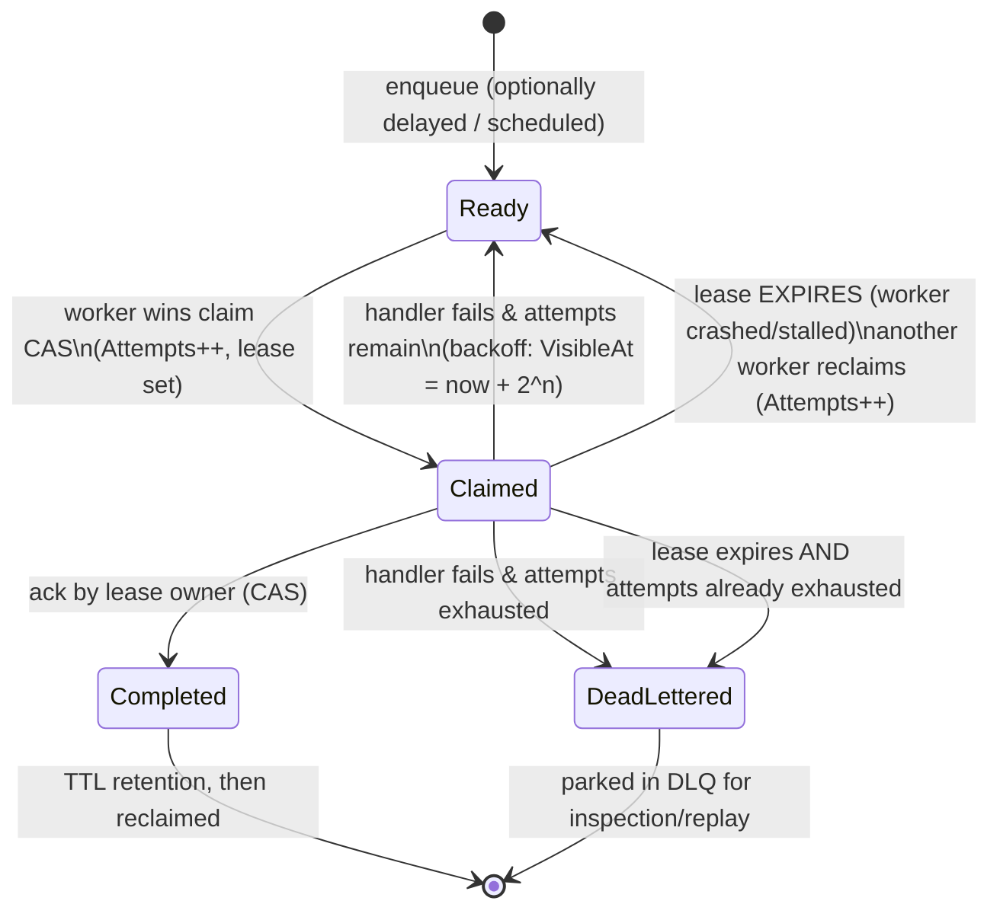
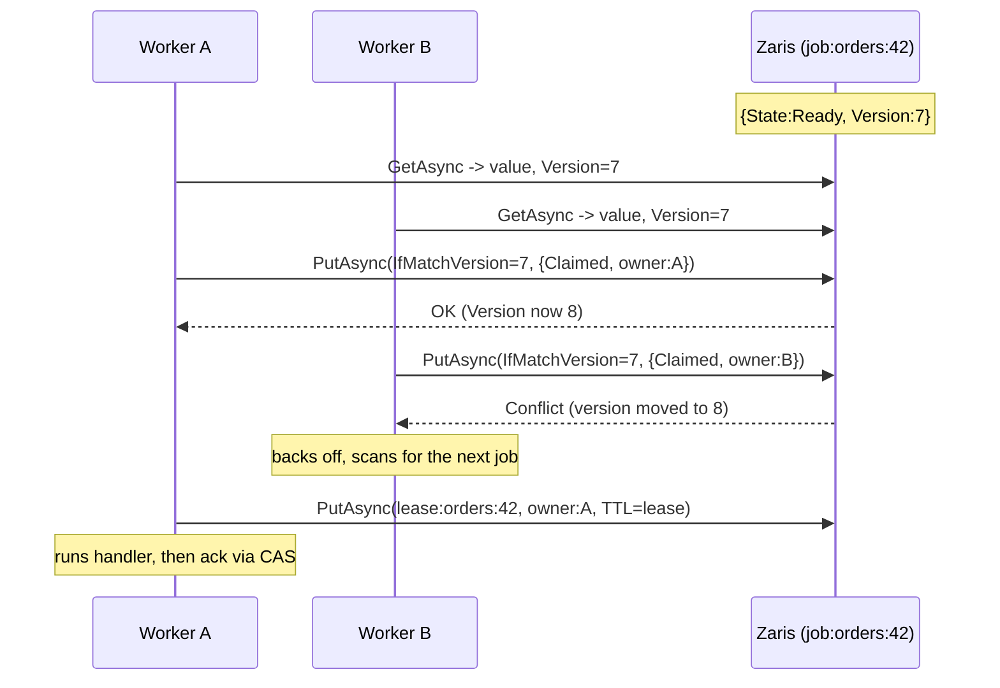

# Distributed Reliable Job Queue on Clustron Zaris

A durable, at-least-once background **job/task queue** — a mini Sidekiq/Hangfire — built entirely on
[Clustron Zaris](https://clustron.io), a .NET 8 distributed in-memory KV store. It supports delayed
and prioritised enqueue, many competing workers that atomically claim jobs under a **visibility
lease**, **ack/complete**, **retry with exponential backoff**, a **dead-letter queue** for poison
jobs, and — the hard part — **lease-expiry requeue** so a crashed or stalled worker's job is safely
picked up by another worker without loss and without violating at-least-once.

The whole thing runs against an **embedded, in-process Zaris engine** (`zaris://inproc/...`), so it is
completely self-contained: `dotnet test` and `dotnet run` need nothing external. Switching to a
networked cluster (`zaris://host:port/...`) is a one-line connection-string change — no code changes.

---

## The problem: what "reliable queue" actually demands

A naive queue (`List.Add` / `List.RemoveAt`) breaks the moment you have more than one worker or a
worker can die. A reliable distributed queue has to guarantee, under concurrency and crashes:

| Property | What it means | How it can break |
| --- | --- | --- |
| **Single-winner claim** | A job is run by at most one worker at a time | Two workers read "ready" and both run it |
| **No loss** | Every enqueued job is eventually processed or dead-lettered | A worker claims a job then crashes; the job vanishes |
| **At-least-once** | A crashed/slow delivery is retried | A job is dropped on the first failure |
| **Lease-expiry requeue** | A stuck worker's job becomes visible again | Job stays "claimed" forever (stranded) |
| **Bounded retries** | Poison jobs don't loop forever | Infinite redelivery of a job that always fails |
| **Ordering by priority / schedule** | High-priority and due jobs run first | FIFO-only, or delayed jobs run immediately |

Zaris gives us exactly one powerful primitive to build all of this on: **optimistic, versioned
compare-and-swap (CAS)**. There is no server-side atomic increment, no multi-key transaction, and no
prefix scan. Everything below is built from a single CAS'd document per job plus a couple of index
documents.

---

## How Zaris is used

### The one primitive: versioned CAS over a document store

`ZarisDocumentStore` (in `Infrastructure/`) wraps `IZarisClient` and exposes read-with-version,
create-if-absent, and compare-and-swap:

```csharp
var r = await client.GetAsync<byte[]>(key);          // r.Value + r.Version.Version (monotonic)
await client.PutAsync(key, bytes, new PutOptions {   // commit iff unchanged
    IfMatchVersion = new ItemVersion(expectedVersion) // -> KvStatus.Conflict on a lost race
});
await client.PutAsync(key, bytes, new PutOptions { IfAbsent = true }); // create-once
```

A losing writer gets `KvStatus.Conflict` and retries the whole read-modify-write. **That single CAS is
the linearization point of the entire queue.**

### Keys (there is no prefix scan — we keep our own indexes)

| Key | Shape | Purpose |
| --- | --- | --- |
| `job:{queue}:{id}` | `Job` document | **Authoritative** job state + lease. Mutated only via CAS. Never deleted while live. |
| `idx:{queue}:active` | set of ids | Work-discovery index: all non-terminal jobs. Written only on enqueue / terminal transition. |
| `idx:{queue}:dlq` | set of ids | Dead-letter index for inspection/replay. |
| `lease:{queue}:{id}` | owner string | In-flight lease marker, written with a **write-time TTL** = lease duration; self-reclaims on crash. |

### Write-time TTL (never `ExpireAsync`)

TTL is always attached at write time via `PutOptions.Metadata.Ttl` — never through a separate expire
call (a known InProc `ExpireAsync` bug). Two uses:

* **In-flight lease marker** `lease:{id}` is written with `Ttl = LeaseDuration`, so if a worker dies
  the marker evaporates on its own — a self-cleaning "in-flight set" for monitoring.
* **Completed job documents** are re-written with `Ttl = CompletedRetention`, so finished receipts
  stay queryable for a window (idempotency / audit) and then self-reclaim.

### Why the lease is *also* a logical timestamp (the crucial design choice)

The **authoritative** lease is the `LeaseExpiresUtc` field stored *inside the durable job document*,
compared against an injectable `IClock`. It is deliberately **not** the TTL key, because a durable
queue must never let the job itself disappear — if the job vanished on lease TTL, a crash would *lose*
the job. So:

* `LeaseExpiresUtc` (logical, in the job doc) → drives correctness: reclaim, and is unit-testable with
  a `ManualClock` (no sleeping).
* `lease:{id}` TTL key (store wall-clock) → auxiliary self-cleaning marker + monitoring, proven by a
  real-time TTL test.

---

## Architecture

### Job state machine



The elegant part: **lease-expiry requeue is not a separate mechanism**. A job is *claimable* when it is
due **and** (`Ready` **or** (`Claimed` with an expired lease)). So a crashed worker's job is just
another claimable job, taken over by the next worker's ordinary claim CAS. No background sweeper is
required for correctness.

```csharp
static bool IsClaimable(Job job, DateTimeOffset now) =>
    job.VisibleAtUtc <= now &&
    (job.State == JobState.Ready ||
     (job.State == JobState.Claimed && job.LeaseExpiresUtc <= now));
```

### Worker claim sequence (why exactly one wins)



If Worker A then crashes, `job:orders:42` stays `Claimed` with `owner:A`. Once `LeaseExpiresUtc`
passes, `IsClaimable` returns true again and Worker B reclaims it with the same CAS pattern
(`Attempts` becomes 2). If A ever comes back and tries to `CompleteAsync`, its CAS fails because the
owner/version changed — so **no double-complete**.

### Component map

```
JobQueue.Core
├── Infrastructure
│   ├── ZarisConnection        connect to inproc or networked store (one line swaps them)
│   ├── ZarisDocumentStore     Read/Create/CAS/Put(+TTL)/Delete/Mutate over IZarisClient
│   └── Clock                  IClock + SystemClock (prod) + ManualClock (deterministic tests)
└── Queue
    ├── Job / JobState         the durable job document
    ├── QueueKeys              every key the queue uses
    ├── IndexSet               CAS'd membership set (active / dlq) — our "prefix scan" substitute
    ├── Backoff                exponential backoff with cap + optional jitter
    ├── JobQueueOptions        lease duration, max attempts, backoff, retention
    ├── JobQueueClient         the engine: Enqueue / TryClaim / Complete / Fail / Stats
    └── Worker                 competing consumer: claim -> run handler -> ack/fail/abandon
JobQueue.Demo                  runnable driver (producers + workers + crashes + poison)
JobQueue.Tests                 16 tests: unit + concurrent + end-to-end integration
```

---

## At-least-once & idempotency

The queue is deliberately **at-least-once**, not exactly-once (which is impossible across a crash
boundary). A job's handler can run more than once when:

* a worker runs the handler, performs side effects, then crashes **before** acking — the lease expires
  and another worker runs it again;
* a worker is slow, its lease expires, a second worker reclaims and runs it concurrently.

**Guidance for handlers (and what the demo models):** make the side effect idempotent, keyed by
`job.Id` (e.g. `INSERT ... ON CONFLICT DO NOTHING`, an idempotency key on the downstream API, or a
"already-sent" marker). The queue guarantees a single **authoritative completion** (only the current
lease owner's `CompleteAsync` CAS succeeds), so you can also dedupe on the completion itself.

---

## Running it

From `job-queue/` (the `nuget.config` resolves `Clustron.*` from nuget.org; Zaris
client version is pinned in `Directory.Build.props`):

```bash
# run the full test suite (unit + concurrency + end-to-end integration)
dotnet test

# run the live demonstration (producers + 8 workers + injected crashes + poison jobs)
dotnet run --project src/JobQueue.Demo -c Release
```

Requires the .NET 8 SDK (or newer). No external process, port, or cluster — the embedded engine runs
in the test/demo process. To point at a real cluster instead, change the connection string in
`ZarisConnection`/`Program.cs` to `zaris://host:port/<store>`; nothing else changes.

---

## Tests (16, all green)

Every test runs against a **real** embedded Zaris store (unique keyspace per test) and the real CAS
path — no mocks. Timing-sensitive logic uses a `ManualClock` so it is deterministic and fast.

| Suite | Proves |
| --- | --- |
| `ClaimRaceTests` | **100 concurrent workers → exactly one** claims a single job; 20 workers over 200 jobs claim each job exactly once (no duplicates). |
| `LeaseExpiryTests` | Live lease blocks reclaim; expired lease lets another worker reclaim (`Attempts++`); crashed owner **cannot** complete after reclaim; reclaim of an attempt-exhausted crashed job → DLQ; **TTL lease marker self-reclaims** (real wall-clock). |
| `RetryAndDeadLetterTests` | Failure reschedules with exponential backoff and is invisible until due; exhausting max attempts → DLQ; backoff math is exponential, capped, overflow-safe. |
| `EnqueueAndLifecycleTests` | Delayed & scheduled jobs invisible until due; higher priority claimed first; ack removes from the active set and cleans the lease marker; idempotent enqueue by stable id does not duplicate. |
| `EndToEndIntegrationTests` | **The whole thing**: 60 jobs, 8 competing workers, injected crashes + poison jobs — proves no loss, at-least-once, no double-complete, DLQ captures exactly the poison. |

```
Passed!  - Failed: 0, Passed: 16, Skipped: 0, Total: 16
```

---

## Observed results (demo evidence)

A full captured run is in [`docs/sample-run.txt`](docs/sample-run.txt). One run (80 jobs: 72 good incl.
12 crash-once + 10 flaky + 10 delayed, 8 poison; 8 workers; 400 ms lease):

```
Good jobs completed      : 72/72  ✓
Dead-letter queue        : 8 jobs ✓  -> [poison-0 .. poison-7]
Active set drained       : 0 remaining ✓
No loss (all terminal)   : ✓ every job accounted for
At-least-once deliveries : 120 handler runs for 80 jobs (>= 80) ✓
No double-complete       : 72 authoritative completions == 72 good jobs ✓
Crashes requeued         : 12 crashes injected; crash-once jobs all completed via lease-expiry reclaim
Retries (backoff)        : 28 transient failures re-scheduled; dead-lettered deliveries: 8
ALL GUARANTEES HELD ✓
```

Reading the evidence against the guarantees:

* **No loss** — all 72 good jobs reached `Completed` and all 8 poison reached the DLQ; the active set
  drained to zero. Every enqueued job is accounted for.
* **At-least-once** — 120 handler runs for 80 jobs. The extra 40 runs are the 12 crash reclaims + 28
  transient retries, i.e. deliveries that happened more than once by design.
* **No double-complete** — authoritative completions equal the good-job count exactly (72), because
  only the current lease owner's ack CAS can win.
* **Lease-expiry requeue works** — the 12 crash-once jobs were abandoned mid-work (never acked) and
  still completed, only possible via another worker reclaiming them after the lease expired.
* **Retry → DLQ works** — flaky jobs recovered within their attempt budget; poison jobs exhausted
  theirs (maxAttempts = 2) and landed in the dead-letter queue, never looping forever.

---

## Design notes & honest limitations

* **Contention is per-job, not global.** The hot claim path only CASes the individual job document;
  it never writes the index. The `idx:active` set is touched only on enqueue and on terminal
  transitions, so workers don't serialise on a single hot key while draining.
* **The active index is a single document.** Fine for thousands of in-flight jobs and for this demo.
  At very large scale it would be sharded (e.g. `idx:active:{bucket}`) or replaced with a Zaris native
  sorted set keyed by `(priority, visibleAt)` to avoid reading every candidate per poll. The
  correctness argument is unchanged because the index is only a *hint* — the claim CAS on the job
  document is always authoritative, and workers self-heal stale index entries.
* **At-least-once, by design.** See the idempotency section; exactly-once across crashes is not
  offered (and isn't achievable without cooperation from the side-effecting downstream).
* **Enqueue is two writes** (job doc, then index add), both idempotent, job-document-first, so a
  retried enqueue heals a partial one without duplicating.
