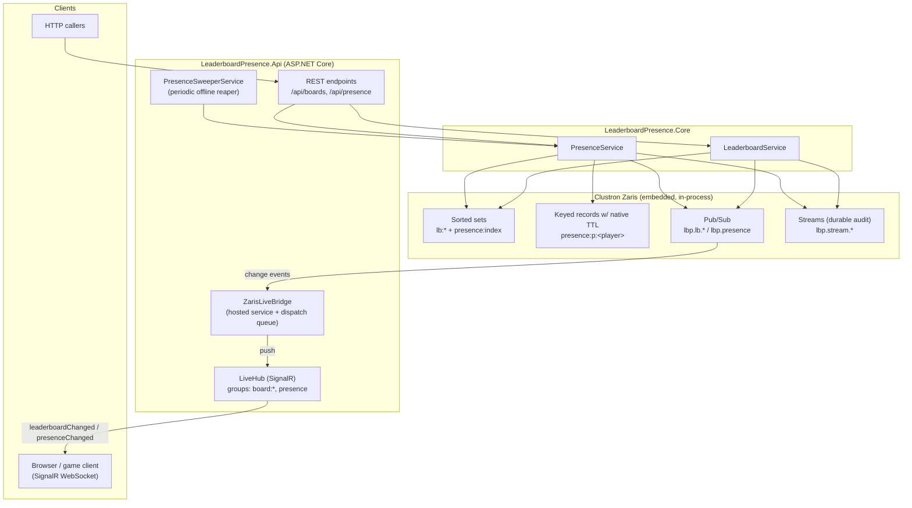
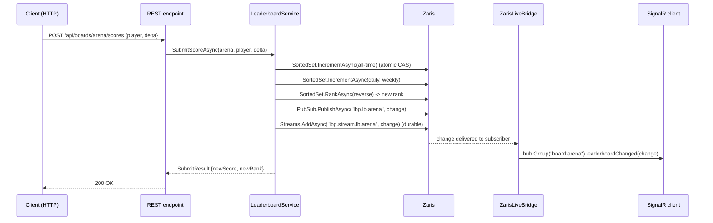

# Real-Time Leaderboard + Presence Service on Clustron Zaris

A complete, self-contained service that solves a genuinely hard distributed-systems problem — a **live gaming / social leaderboard with online-status presence at scale** — on top of [Clustron Zaris](https://clustron.io), a .NET 8 distributed in-memory data store.

It is **not** a toy. It handles concurrent score updates without lost updates, ties, rank/neighbour queries over large populations, rolling daily/weekly windows, heartbeat-driven presence with native TTL expiry, and real-time push to connected clients over SignalR — all backed by Zaris **native sorted sets**, **native TTL**, **pub/sub**, and **streams**. It runs entirely in-process (embedded Zaris, no cluster to stand up) and ships with a full TDD test suite and an end-to-end load simulation.

```
dotnet test     # 28 tests, green
dotnet run      # boots the API + SignalR + embedded Zaris, runs a 400-player / 4,000-submit live simulation
```

---

## The problem

A live leaderboard at scale is deceptively hard:

| Challenge | Why it is hard | How this solution handles it |
|---|---|---|
| **Concurrent score updates** | Thousands of players score at once; a naive read-modify-write loses updates | Zaris sorted-set `IncrementAsync` is an **atomic, linearizable** CAS operation — verified at 0 lost updates under 1,000+ concurrent same-key increments |
| **Ranking & neighbours** | "What rank am I? Who's just above/below me?" over millions of members must be fast | Zaris sorted set gives O(log n) rank and range-by-rank; neighbours = one centred range query |
| **Ties** | Equal scores need a deterministic, stable order | Zaris orders by `(score, member)` — ties break lexicographically, deterministically |
| **Windowed boards** | Daily / weekly boards that reset without wiping all-time | One sorted set **per window**, keyed by date stamp; the window "resets" simply by the key rotating as the clock advances |
| **Presence** | Online/away/offline from heartbeats, expiring automatically when a player goes quiet | A sorted set scored by last-heartbeat time (O(log n) "who's online" + sweepable) **plus** a per-player key with a **native Zaris TTL** that self-reclaims |
| **Live updates** | Clients must see changes instantly, not by polling | Every change is published on Zaris **pub/sub** and bridged to clients over **SignalR**; durable replay via a Zaris **stream** |

---

## Architecture



### Write path and live fan-out (a single score submission)



---

## How Zaris is used (the heart of the solution)

### 1. Sorted sets — the leaderboard itself
Each board/window is one Zaris sorted set (`member = player`, `score = double`). `IncrementAsync` is an **atomic read-modify-write under optimistic CAS**, so concurrent submissions never lose updates. Reads use the sorted set's ordering directly:

| Operation | Zaris call |
|---|---|
| Submit (accumulate) | `SortedSets.IncrementAsync(key, player, delta)` |
| Set absolute score | `SortedSets.AddAsync(key, [ScoredMember(player, score)])` |
| Top-N | `SortedSets.RangeByRankAsync(key, 0, N-1, reverse: true)` |
| A player's rank (1-based) | `SortedSets.RankAsync(key, player, reverse: true)` + 1 |
| Neighbours | `RankAsync` to find the centre, then `RangeByRankAsync(center-r, center+r, reverse: true)` |
| Member count | `SortedSets.CountAsync(key)` |

Ties are broken lexicographically by member, exactly like Redis sorted sets, giving stable, deterministic ordering.

### 2. Windowed leaderboards — key rotation (daily / weekly)
A submission is mirrored into three sorted sets:

```
lb:{board}:all                 all-time
lb:{board}:d:{yyyyMMdd}        current UTC day
lb:{board}:w:{yyyy-Www}        current ISO-8601 week
```

The window **resets automatically** because the key is derived from the clock: when the clock crosses midnight UTC, `lb:arena:d:20260101` is simply no longer the "current" key and the new day's set starts empty — while all-time is untouched. `ReapExpiredWindowsAsync` deletes window keys older than the configured retention (`DeleteAsync` on the rotated-out keys).

### 3. Native TTL — presence expiry
Each heartbeat writes a per-player record **with a server-honoured TTL set at write time** via `PutOptions.Metadata.Ttl`:

```csharp
var opts = new PutOptions { Metadata = new EntryMetadata { Ttl = awayWindow + grace } };
await zaris.PutAsync<byte[]>($"presence:p:{player}", recordBytes, opts);
```

Zaris expires the key automatically once the player stops heart-beating — proven end-to-end in `PresenceTtlTests` (key present right after a heartbeat, `NotFound` after the TTL elapses). This is genuine server-side reclamation, not an application timer.

### 4. Sorted set as a presence registry
Every tracked player is also a member of `presence:index`, scored by their last-heartbeat epoch-millisecond. This turns presence queries into cheap score-range queries driven by the clock:

```
Online  : score ≥ now − OnlineWindow      -> CountByScoreAsync / RangeByScoreAsync
Away     : OnlineWindow < age ≤ AwayWindow
Offline  : age > AwayWindow                 (reaped by SweepAsync: RangeByScore + RemoveAsync)
```

### 5. Pub/Sub — live fan-out
Every leaderboard and presence change is published cluster-wide:

```
lbp.lb.{board}   (pattern lbp.lb.* for "all boards")
lbp.presence
```

`ZarisLiveBridge` is the single subscriber that relays events to SignalR groups. The subscription callback only **enqueues** onto an in-memory channel; a background pump performs the WebSocket sends — deliberately decoupling the write path from fan-out I/O.

### 6. Streams — durable audit log
Every change is also appended to a Zaris stream (`lbp.stream.lb.{board}`, `lbp.stream.presence`) with inline `MAXLEN` trimming, so the last N changes can be **replayed** (e.g. to warm a late-joining dashboard). `GET /api/boards/{board}/audit` reads them back newest-first.

> **Note on a Zaris embedded-mode quirk (documented honestly):** in the embedded/in-process engine, `ExpireAsync` (setting a TTL on an *existing* key, as opposed to at write time) returns `Unavailable` because its readiness check treats a standalone (null-topology) node as "not ready". This solution therefore sets presence TTLs **at write time** (`PutOptions.Metadata.Ttl`), which works perfectly, and uses **date-stamped key rotation + explicit reaping** for leaderboard windows rather than relying on `ExpireAsync`. On a real multi-node cluster, `ExpireAsync` is available and window keys can additionally be given a TTL.

---

## Key / channel / stream schema

| Purpose | Zaris key | Type |
|---|---|---|
| All-time board | `lb:{board}:all` | sorted set |
| Daily board | `lb:{board}:d:{yyyyMMdd}` | sorted set |
| Weekly board | `lb:{board}:w:{yyyy-Www}` | sorted set |
| Presence registry | `presence:index` | sorted set (score = last-heartbeat ms) |
| Per-player presence record | `presence:p:{player}` | keyed value **with native TTL** |
| Leaderboard changes | `lbp.lb.{board}` | pub/sub channel |
| Presence changes | `lbp.presence` | pub/sub channel |
| Leaderboard audit | `lbp.stream.lb.{board}` | stream |
| Presence audit | `lbp.stream.presence` | stream |

---

## How to run

Prerequisites: **.NET 8 SDK**. The Zaris 2.0.1 client packages (and everything else) resolve from nuget.org via `nuget.config`. No cluster, no ports to configure — Zaris runs embedded in-process.

```bash
cd E:\Personal\projects\zaris-solutions\leaderboard-presence

# 1. Run the test suite (unit + concurrency integration) — 28 tests
dotnet test

# 2. Run the end-to-end simulation (default). Boots the real HTTP+SignalR server
#    backed by embedded Zaris, connects a live SignalR client, drives 400 players /
#    4,000 concurrent score submits, verifies correctness, shows live push + presence decay.
dotnet run --project src/LeaderboardPresence.Api

# 3. Run the server for manual exploration / real clients (blocks)
dotnet run --project src/LeaderboardPresence.Api -- serve http://127.0.0.1:5080

# 4. Pure Zaris core-path throughput benchmark (no HTTP): bench <submits> <concurrency> [publish]
dotnet run --project src/LeaderboardPresence.Api -- bench 50000 64
```

### REST API (mode `serve`)

```
POST /api/boards/{board}/scores              { "player": "alice", "delta": 100 }   -> SubmitResult
GET  /api/boards/{board}/top?count=10&window=AllTime|Daily|Weekly
GET  /api/boards/{board}/players/{player}?window=...                               -> rank + score
GET  /api/boards/{board}/players/{player}/neighbors?radius=3
GET  /api/boards/{board}/count?window=...
GET  /api/boards/{board}/audit?count=20                                            -> replay from stream
POST /api/presence/{player}/heartbeat        { "detail": "mobile" }                -> snapshot
POST /api/presence/{player}/status           { "status": "Away", "detail": null }
GET  /api/presence/{player}                                                        -> online/away/offline
GET  /api/presence/online
GET  /api/presence/count
```

### SignalR hub `/hub/live`

```
client -> server : JoinBoard(board), LeaveBoard(board), JoinPresence(), LeavePresence()
server -> client : leaderboardChanged(LeaderboardChange), presenceChanged(PresenceChange)
```

---

## Simulation results

A representative `dotnet run` (full capture in [`SIMULATION_OUTPUT.txt`](SIMULATION_OUTPUT.txt)):

```
[phase 1] 400 players sending heartbeats (coming online)...
[phase 1] online now = 400

[phase 2] 4,000 concurrent score submissions...
[phase 2] 4,000 submits OK in 34.06s = 117 ops/sec

[phase 3] verifying leaderboard correctness against local oracle...
[phase 3] players on board      : 400 (expected 400)
[phase 3] score sum (server)    : 22,074
[phase 3] score sum (oracle)    : 22,074
[phase 3] per-player mismatches : 0
[phase 3] strictly ordered      : True
[phase 3] RESULT                : CORRECT ✓

[phase 4] presence decay: keeping 50 players alive, letting the rest go idle...
   t+2s  online=  50   player399 (idle) = Offline

---- live push (SignalR) ----
leaderboard events received by live client : 4,000 (of 4,000 submits)
presence events received by live client    : 850
```

**What this proves:**
- **Correctness under concurrency** — after 4,000 concurrent submissions across 40 workers, the server's per-player scores match an independent local oracle **exactly** (0 mismatches), the total is conserved, and the board is strictly ordered. No lost updates.
- **Live propagation** — the SignalR client received **4,000 / 4,000** leaderboard change events and 850 presence events, end-to-end: HTTP → Zaris sorted set → Zaris pub/sub → bridge → SignalR.
- **Presence expiry** — idle players decay to `Offline` and the online count collapses to exactly the kept-alive set.

### Throughput (and an honest scaling finding)

| Path | Throughput | Notes |
|---|---|---|
| Core sorted-set data path (no fan-out, `bench`) | **~1,450 submits/sec** (≈ 5,800 sorted-set ops/sec) | 3 window-increments + 1 rank query per submit |
| + pub/sub + stream fan-out | ~550 submits/sec | per-event publish + durable append |
| + full HTTP round-trip + SignalR | ~110–120 submits/sec | loopback latency serialised on the hot key |

The limiter is **not** Zaris raw speed but the **single hot board key**: a sorted set is a whole-value CAS structure, so every mutation serialises/deserialises the whole set, and all writers to one board contend on one key. This is the classic leaderboard scaling characteristic. In production you would **shard** a mega-board across N key-shards (e.g. by `hash(player) % N`) and merge top-N at read time, or keep per-region boards — the service's key schema is designed to make that a drop-in change. Correctness is unconditional; throughput scales with shard count.

Separately verified (`ConcurrencyIntegrationTests`): **1,000+ concurrent increments to a single member produce an exact score with zero conflicts** — Zaris's CAS-retry fully absorbs the contention.

---

## Tests (TDD)

28 tests, written test-first, each against an **isolated embedded Zaris store** with a hand-advanceable `FakeClock` for deterministic time:

| Suite | Covers |
|---|---|
| `LeaderboardRankingTests` | top-N ordering, 1-based ranks, **ties** (lexicographic), atomic accumulation, rank, **neighbours** (incl. top-edge clamping), count, empty-board safety |
| `WindowedLeaderboardTests` | daily **reset on day rollover**, weekly independence, rolling-window toggle, retention reaping |
| `PresenceTests` | online→away→offline decay, heartbeat refresh, unknown = offline, **manual away override**, logout, status listing + online count, **sweep** reaping |
| `PresenceTtlTests` | **native Zaris write-time TTL** expiry of the per-player key (real clock) |
| `PubSubStreamTests` | live delivery of leaderboard + presence changes, pattern subscribe, **durable stream replay** |
| `ConcurrencyIntegrationTests` | 32×50 concurrent writers vs an oracle (0 lost updates, correct order), 200 concurrent heartbeats |

```
Passed!  - Failed: 0, Passed: 28, Skipped: 0, Total: 28
```

---

## Project layout

```
leaderboard-presence/
├── LeaderboardPresence.slnx
├── nuget.config                     # local Zaris 2.0.1 feed + nuget.org
├── Directory.Build.props            # net8.0, nullable, Zaris version pin
├── README.md
├── SIMULATION_OUTPUT.txt            # captured end-to-end run (evidence)
├── src/
│   ├── LeaderboardPresence.Core/    # the service (no ASP.NET dependency)
│   │   ├── Clock.cs                 # IClock / SystemClock / FakeClock
│   │   ├── Models.cs                # RankedEntry, SubmitResult, PresenceSnapshot, *Change events
│   │   ├── Options.cs               # LeaderboardOptions / PresenceOptions
│   │   ├── Keys.cs                  # key / channel / stream schema + window date math
│   │   ├── Json.cs                  # event codec + stored PresenceRecord
│   │   ├── ILeaderboardService.cs / LeaderboardService.cs
│   │   ├── IPresenceService.cs / PresenceService.cs
│   │   └── LeaderboardPresenceSystem.cs   # composition root (embedded Zaris connect)
│   └── LeaderboardPresence.Api/     # ASP.NET Core + SignalR + simulation
│       ├── Program.cs               # modes: simulate (default) / serve / bench
│       ├── AppBuilder.cs            # DI, REST endpoints, hub mapping
│       ├── Hubs/LiveHub.cs
│       ├── ZarisLiveBridge.cs       # Zaris pub/sub -> SignalR + presence sweeper
│       └── Simulation/Simulator.cs  # end-to-end load driver + oracle verification
└── tests/
    └── LeaderboardPresence.Tests/   # 28 xUnit tests
```

## Design notes

- **Clock injection** makes every time-dependent behaviour (presence decay, window rotation) deterministic under test, while production uses `SystemClock`.
- **Best-effort fan-out**: a pub/sub or stream hiccup never fails a score submit — change propagation is decoupled from the authoritative write.
- **Core has zero web dependency** — it is a reusable library; the API project is a thin transport + live-push shell over it.
- **Native-first** — every feature is built on a native Zaris API (sorted set, TTL, pub/sub, stream); nothing reaches for a bespoke protocol.
