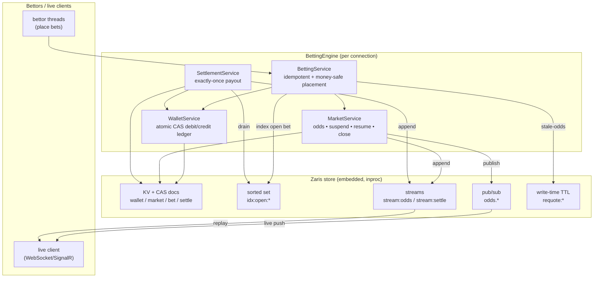
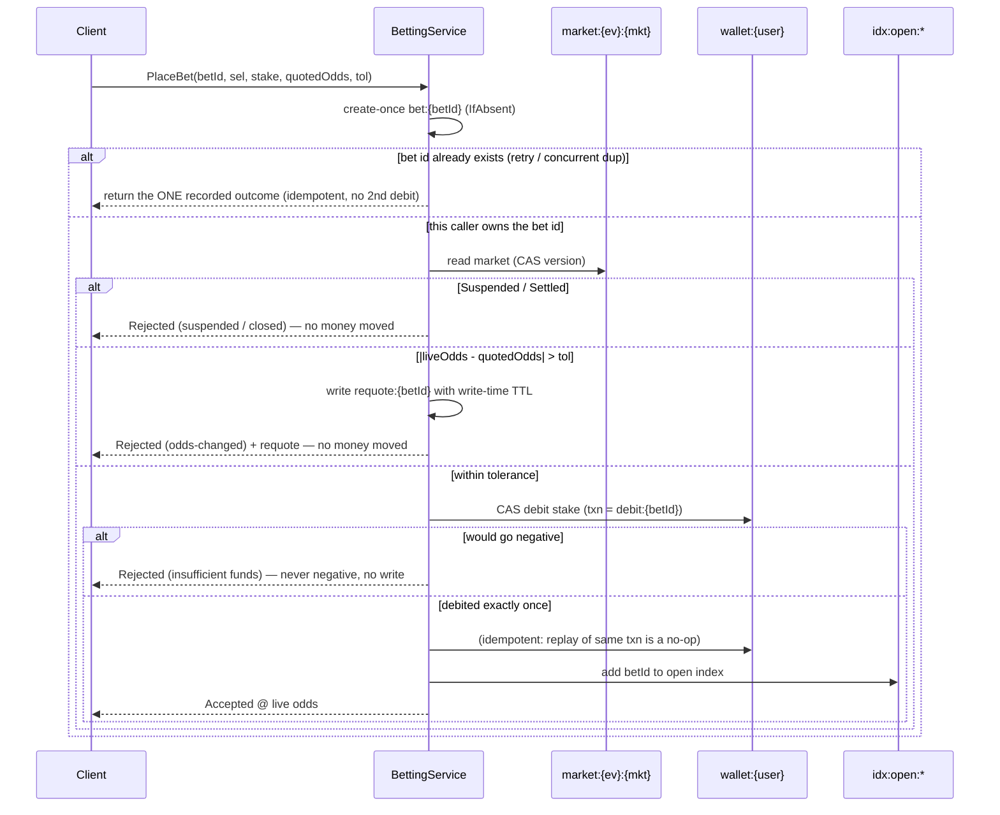

# Live In-Play Betting Engine on Clustron Zaris

A complete, runnable example of the **correctness-critical, low-latency core** of an in-play
(live) sports/events betting engine, built on [Clustron Zaris](https://clustron.io) — a distributed,
in-memory key-value store for .NET 8.

> This is a software-architecture exercise that stress-tests Zaris under a demanding real-time
> workload. It models the hard parts of an in-play engine (money-safe wallets, idempotent placement,
> odds-staleness protection, market suspension, exactly-once settlement). **It does not facilitate
> real gambling** — there are no real odds providers, payment rails, or accounts.

Everything runs **in-process against an embedded Zaris engine** (`zaris://inproc/...`) — no cluster,
no ports, no external services. `dotnet test` is green and `dotnet run` demonstrates the full
live lifecycle end-to-end and prints a money-safety audit.

---

## 1. Why in-play betting is a hard problem

A pre-match betting system is comparatively easy: odds are stable, and you have seconds to accept a
bet. An **in-play** engine is the opposite — it is simultaneously a *hard real-time* problem and a
*hard correctness* problem, and the two fight each other:

| Pressure | What makes it hard |
|---|---|
| **Odds move constantly** | Every goal, point or momentum swing reprices a market in milliseconds. A bet must be struck against the price the bettor actually saw — accepting a stake on *stale* odds is an instant, systematic loss. |
| **Markets must freeze instantly** | The microsecond an event changes (a goal), the market must **suspend** so no bet lands on soon-to-be-wrong odds — then reopen repriced. |
| **Money must be exact under extreme concurrency** | Thousands of bettors hammer the same markets, and one bettor can fire many bets at once. A wallet must **never go negative** and a stake must **never be double-charged**, even under a lost-update race. |
| **Clients retry** | Mobile clients on flaky connections resend the same placement. The engine must be **idempotent**: a retry returns the original outcome, never a second bet or a second debit. |
| **Settlement must be exactly-once and crash-safe** | When the event resolves, every open bet pays out or closes — **once**. A crashed or re-run settlement pass must never pay a winner twice. |

The thread tying all of these together is **money safety**: no money is ever created or destroyed,
no wallet overdraws, and every payout happens exactly once. That is a distributed-state-consistency
problem, which is exactly where Zaris earns its place.

---

## 2. How Zaris is used

Zaris gives us three primitives, and the whole engine is built from them:

### 2.1 Optimistic, versioned compare-and-swap (CAS) — the atomicity primitive

Zaris has **no server-side atomic increment** and no multi-key transaction. Instead, every read
returns the value *and its monotonic version*, and a write can be made conditional:

```csharp
var r = await z.GetAsync<byte[]>(key);          // r.Value + r.Version.Version
// ... modify ...
var put = await z.PutAsync(key, bytes, new PutOptions { IfMatchVersion = new ItemVersion(v) });
if (put.Status == KvStatus.Conflict) { /* someone else won — re-read and retry */ }
```

A document therefore becomes an **atomic unit**: a read-modify-write that loops on `Conflict` is a
lock-free transaction over that one document. `PutOptions { IfAbsent = true }` gives **create-once**
semantics (the basis of idempotency ledgers and the settlement log).

This is wrapped once in [`DocumentStore`](src/LiveBetting.Core/Infrastructure/DocumentStore.cs)
(`ReadAsync` / `CreateAsync` / `CompareAndSwapAsync` / `MutateAsync`) and used everywhere.

### 2.2 Native pub/sub — instant live fan-out

Odds changes, suspensions and resumes are published on a per-market channel for instant push to
connected clients (a WebSocket/SignalR bridge subscribes once):

```csharp
await z.PubSub.PublishAsync($"odds.{ev}.{mkt}", payload);                 // publish a tick
await z.PubSub.SubscribeAsync(new[] { $"odds.{ev}.{mkt}" }, onMessage);   // one market
await z.PubSub.PSubscribeAsync(new[] { "odds.*" }, onMessage);            // every market (pattern)
```

### 2.3 Native streams — the durable, replayable log

Pub/sub is at-most-once (a client that wasn't connected misses a tick). So the **same** events are
also appended to an append-only, id-ordered Zaris **stream**, which a late/reconnecting client
replays for the exact ordered history. Streams back two logs:

```csharp
await z.Streams.AddAsync(streamKey, new[]{ KeyValuePair.Create("data", bytes) }, "*", maxLen, null, false);
var entries = await z.Streams.RangeAsync(streamKey, "-", "+", count, reverse: true); // newest-first replay
```

* `stream:odds:{ev}:{mkt}` — the live odds/suspend/resume feed (durable replay).
* `stream:settle:{ev}:{mkt}` — the **durable settlement log** (the audit record of every payout decision).

### 2.4 Write-time TTL — self-reclaiming short-lived state

When a bet is rejected for stale odds, the engine writes a **requote token** carrying the fresh
price, with a TTL set **at write time** via `PutOptions.Metadata.Ttl` (never a separate expire call,
which has a known bug on the InProc path). The token self-reclaims if the client never re-quotes:

```csharp
await z.PutAsync(key, bytes, new PutOptions { Metadata = new EntryMetadata { Ttl = TimeSpan.FromSeconds(15) } });
```

### 2.5 Key / channel / stream map

All names live in [`Keys.cs`](src/LiveBetting.Core/Infrastructure/Keys.cs):

| Name | Zaris type | Purpose |
|---|---|---|
| `wallet:{userId}` | KV doc (CAS) | Balance + **applied-transaction ledger** (exactly-once money) |
| `market:{ev}:{mkt}` | KV doc (CAS) | Selections+odds, status (Open/Suspended/Settled), winner |
| `bet:{betId}` | KV doc (create-once + CAS) | One bet; **idempotency anchor** keyed by client bet id |
| `settle:{betId}` | KV doc (create-once) | Durable per-bet settlement marker (exactly-once proof) |
| `requote:{betId}` | KV doc (**write-time TTL**) | Self-expiring stale-odds requote offer |
| `idx:open:{ev}:{mkt}` | Sorted set | Index of still-open bets on a market (contention-free) |
| `odds.{ev}.{mkt}` / `odds.*` | Pub/sub channel | Live feed fan-out (per-market / pattern) |
| `stream:odds:{ev}:{mkt}` | Stream | Durable, replayable odds feed |
| `stream:settle:{ev}:{mkt}` | Stream | Durable settlement log |

---

## 3. Architecture



### Bet-placement sequence (the hard path)



The commit point is the **wallet debit**, under transaction id `debit:{betId}`. Because the wallet's
applied-transaction ledger makes that debit idempotent, the whole placement is money-safe regardless
of retries, races, or a crash between steps.

### Exactly-once settlement

For each open bet on a resolved market, the payout for a winner is **credited before** the bet is
marked `Won` (transaction id `payout:{betId}`, idempotent). A crash between crediting and marking
simply re-credits as a no-op on replay and then marks the bet — so a winner is **never paid twice
nor missed**. Only bets still `Placed` are processed, so re-running settlement touches no money; the
create-once `settle:{betId}` marker and the `stream:settle:*` stream are the durable audit record.

---

## 4. Running it

Prerequisites: **.NET 8 SDK** (the repo also builds under newer SDKs). The Zaris client NuGets
(`Clustron.Zaris.*` 2.0.1, and everything else) resolve from nuget.org via
[`nuget.config`](nuget.config).

```powershell
# from this folder
dotnet test        # runs the unit + integration suite (25 tests)
dotnet run --project src/LiveBetting.Demo    # runs the end-to-end demo
# or do both and capture the demo output to docs/demo-output.txt:
./run-demo.ps1
```

No ports are opened and no cluster is required — the engine runs on an embedded in-process Zaris
store. To instead target a real local node, pass a networked connection string to
`BettingEngine.ConnectAsync`, e.g. `zaris://127.0.0.1:7861/betting` (client port band 7861–7899);
the engine code is identical.

---

## 5. Tests

`dotnet test` → **25 passing** tests ([tests/LiveBetting.Tests](tests/LiveBetting.Tests)), strict
test-first:

| Suite | Proves |
|---|---|
| `WalletAtomicDebitTests` | **1000 concurrent debits** on one wallet are exact & never negative; idempotent by txn id; concurrent duplicate txn ids apply at most once each |
| `IdempotentPlacementTests` | A retried bet id never double-places or double-charges, incl. 25 concurrent duplicate submissions |
| `StaleOddsTests` | A bet whose odds drifted past tolerance is requoted (not struck); within-tolerance is struck at the live price |
| `WriteTimeTtlTests` | The requote token carries a **live TTL set at write time**; none written for an accepted bet |
| `SuspensionTests` | Suspension blocks bets; resume restores them at new odds; a storm suspended mid-flight takes no stake after the suspension point |
| `SettlementExactlyOnceTests` | Winners paid / losers closed; **re-running** settlement (and 5 concurrent passes) pays nobody twice; durable settlement log |
| `FeedPubSubStreamTests` | Odds changes fan out over pub/sub (incl. pattern subscribe); feed history is durably replayable in order |
| `LifecycleIntegrationTests` | Full create → tick → place → suspend → resume → settle across **two connections to one shared store**, with money conserved and settle-once |

---

## 6. Observed results (money-safety & exactly-once)

From a representative `dotnet run` (full transcript in [docs/demo-output.txt](docs/demo-output.txt)):

**Race-free wallet debit — 1000 concurrent placements on ONE wallet**
```
1000 concurrent bets in ~0.7s  →  accepted=666  insufficient-funds=334
wallet: opening 1000.00  final 1.00  (each accepted bet staked 1.50)
[PASS] every accepted debit applied against a fresh balance (exact, no lost update)
[PASS] wallet never went negative
[PASS] accepted exactly as many bets as the balance could fund — not one more
```

**Idempotent placement — same bet id submitted 30× concurrently**
```
accepted-results=30  flagged-as-replay=29
wallet: 100.00 → 60.00   (stake 40.00 debited exactly once)
```

**Odds-staleness protection**
```
quoted 2.00, live 2.60, tolerance 0.10  →  Rejected/OddsChanged, requote=2.60
requote token stored with write-time TTL — remaining 15.0s (self-reclaims, no delete)
```

**Betting storm (400 bettors) + suspension + settlement**
```
461 placement calls → accepted 252 (202 distinct placed) | stale 80 | funds 49 | suspended 80 | retries 61
SETTLE winner=home: settled=202 won=104 lost=98 staked=2913.00 paid=3174.88
[PASS] no wallet is negative
[PASS] money staked during storm == total stake settled (no double-spend)
[PASS] conservation: opening float == final wallets + house net (stakes - payouts)
[PASS] re-running settlement 3x pays nobody twice (balances unchanged)
[PASS] durable settlement log holds one record per settled bet
RESULT: ALL MONEY-SAFETY & EXACTLY-ONCE INVARIANTS HELD ✅
```

(The storm counts vary run-to-run because the workload is genuinely concurrent; the **invariants**
always hold.)

---

## 7. Project layout

```
live-events-betting/
├─ src/LiveBetting.Core/
│  ├─ Infrastructure/   Json, ZarisConnection, DocumentStore (CAS), Keys, Clock
│  ├─ Domain/           Money (minor units), Models (Wallet/Market/Bet), Events
│  ├─ Services/         WalletService, MarketService, BettingService, SettlementService
│  └─ BettingEngine.cs  composition root
├─ src/LiveBetting.Demo/   Program.cs (evidence demo) + Simulator.cs (concurrent storm)
├─ tests/LiveBetting.Tests/
├─ docs/demo-output.txt    captured demo transcript
├─ nuget.config            resolves Clustron.* (and all packages) from nuget.org
└─ run-demo.ps1
```

## 8. Design notes & honest limitations

* **Money is integer minor units (`long`) everywhere.** Balances and payouts are never floating point;
  only odds are `decimal` multipliers. Payout = `round(stake_minor × odds)`.
* **The wallet's applied-txn ledger is the single source of exactly-once truth** for money. For this
  demo it grows unbounded (one id per debit/payout); a production system would compact settled ids out
  of band (e.g. once a market is fully settled and reconciled).
* **Placement acceptance is committed at the wallet debit**, not atomically with the bet record (Zaris
  gives single-document atomicity, not a cross-key transaction). The creator drives its bet to a
  terminal state in-call; concurrent duplicates observe that one outcome; a crash mid-placement is
  recovered by re-driving, which is safe because the debit is idempotent by txn id. A rare adopt-race
  is covered by an idempotent refund (`refund:{betId}`) so money always conserves.
* **This is the engine core, not a product** — no auth, no real odds feed, no payment integration,
  and no responsible-gambling controls. It exists to exercise Zaris under a real-time, money-critical
  workload.
