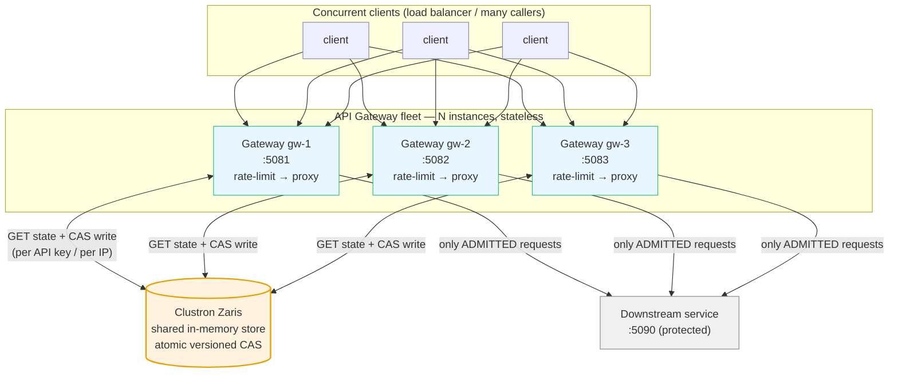
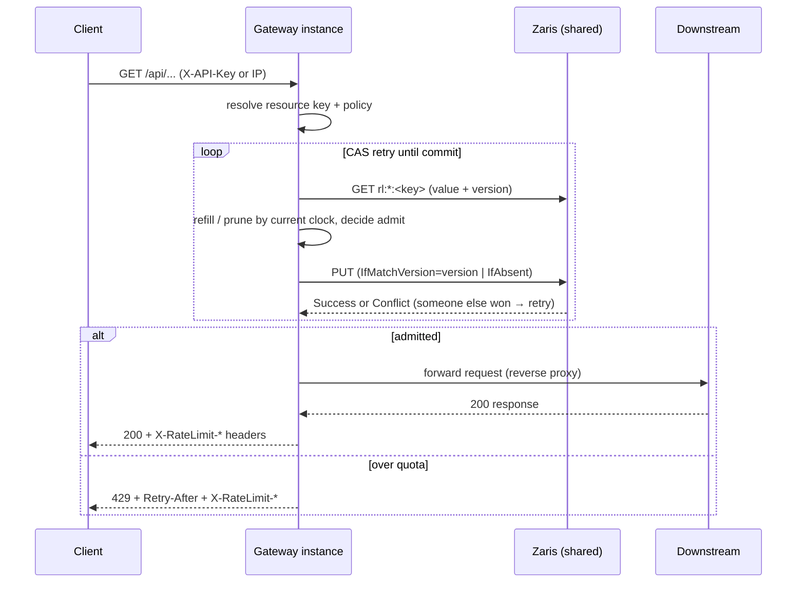

# Distributed Rate Limiter + API Gateway on Clustron Zaris

A real, runnable ASP.NET Core **API gateway / reverse proxy** whose rate limits are enforced
**globally across every gateway instance**, because the limiter state lives in a shared
[Clustron Zaris](https://clustron.io) distributed in-memory store — not in each process's memory.

It implements two correct, race-free algorithms (**sliding-window log** and **token bucket**),
per-API-key and per-IP policies, standard `X-RateLimit-*` / `Retry-After` headers and `429`
responses, a small downstream service it proxies to, a concurrent load driver that proves limits
hold globally, and a full test suite (`dotnet test` = 12 green).

```
dotnet test        # 12 passing: algorithm boundary/expiry/concurrency + multi-instance global limit
dotnet run --project src/LoadDriver   # end-to-end demo: 3 gateways, 1 shared store, concurrent load
```

---

## 1. The problem

A rate limiter answers one question on every request: *"has this caller used up its quota?"* That
requires **counting**, and the count must be **shared and consistent** across everything that serves
traffic. In production an API gateway is never a single process — it is N replicas behind a load
balancer, autoscaled across machines. The moment you keep the count in process memory:

- Each of the N replicas enforces its **own** limit, so a "100 req/min" policy actually admits
  up to `100 × N` req/min. The limit silently scales with your fleet.
- A caller's consecutive requests hit different replicas, so no single replica even sees the full
  request stream.

So the count has to move to **shared state**. And that is where it gets hard:

1. **Concurrency / races.** `read count → check → write count+1` is a classic read-modify-write.
   Under load, hundreds of requests across many machines run that sequence against the *same* key
   simultaneously. A naive implementation double-admits: two requests both read `99`, both decide
   "under 100", both write `100`. You admitted 101. The update must be **atomic** — exactly one
   writer per state transition.
2. **Time & expiry.** Windows slide; buckets refill. State must carry timestamps and be garbage
   collected when a caller goes idle, without a background sweeper per key.
3. **Latency.** The check is on the hot path of *every* request, so the shared store must be fast
   (in-memory) and the algorithm must minimise round-trips.
4. **Correctness under failure.** If the store is unreachable, do you fail open (ignore the limit)
   or fail closed (reject)? A gateway should fail closed by default.

This solution addresses all four using Zaris as the shared, atomic, in-memory state store.

---

## 2. Architecture



Per-request pipeline inside each gateway instance:



The gateways are **stateless and identical**. All shared truth is in Zaris, so adding or removing a
gateway instance changes throughput but never the enforced limit.

---

## 3. How Zaris is used

Zaris is a .NET distributed in-memory key/value store. The limiter uses three primitives from the
`Clustron.Zaris.Client` API, all exercised by the code in
[`src/RateLimiting/ZarisStateStore.cs`](src/RateLimiting/ZarisStateStore.cs):

| Need | Zaris API | How it's used |
|------|-----------|---------------|
| Read state + its version | `GetAsync<byte[]>(key)` → `KvResult<T>.Value` + `.Version` | Every read returns a monotonic `Version` alongside the value. |
| **Atomic** state transition | `PutAsync(key, val, new PutOptions { IfMatchVersion = v })` | Compare-and-swap: the write commits **only if** the stored version is still `v`. A losing concurrent writer gets `KvStatus.Conflict` and retries. This is what makes the counter race-free. |
| First-write / create | `PutAsync(key, val, new PutOptions { IfAbsent = true })` | Creates the key only if still absent (handles the "two requests create the same bucket at once" race — one wins, the other retries as an update). |
| Idle-key GC | `ExpireAsync(key, ttl)` | Best-effort TTL so buckets/windows for callers that go quiet are reclaimed. Correctness never depends on it (see below). |

### Keys

| Algorithm | Key shape | Value (JSON) |
|-----------|-----------|--------------|
| Sliding-window log | `rl:sw:key:<apikey>` or `rl:sw:ip:<ip>` | `{ "t": [<unix-ms timestamps in window>] }` |
| Token bucket | `rl:tb:key:<apikey>` or `rl:tb:ip:<ip>` | `{ "tokens": <double>, "lastMs": <unix-ms> }` |

### Atomicity — the core trick

Rate limiting is a read-modify-write. Zaris has no server-side "increment if under N" op exposed on
the client, so the limiter builds the atomic transition itself with **optimistic concurrency / CAS**:

```
read value + version V
compute next state from the value and the current clock
PUT next state with IfMatchVersion = V
   ├─ Success  → we won; our transition is the single authoritative one
   └─ Conflict → someone else committed between our read and write; loop and retry
```

Because exactly one writer per version can win, N concurrent requests across N machines can never
both "spend" the same slot. This is verified directly by the tests (`1000` racing requests against
one key → **exactly** `limit` admitted) and by the live demo.

> Why not fail-open TTL reliance? TTL is only used to garbage-collect idle keys. Every decision is
> recomputed from the **stored state + the current wall clock** (prune expired timestamps / lazily
> refill tokens), so even if a key outlives its logical window the math still yields the correct
> answer. TTL keeps memory bounded; it is never load-bearing for correctness.

### Deployment shape — one line

The store is chosen entirely by the connection string
([`ZarisStoreFactory`](src/RateLimiting/ZarisStoreFactory.cs)):

- `zaris://inproc/<store>` — **embedded** engine. Multiple client connections *in the same process*
  to the same store name share one backing engine. The demo and the integration test host several
  gateway instances in one process this way — genuinely sharing a real Zaris store — which keeps the
  whole thing self-contained (no cluster, no ports to provision).
- `zaris://host:port/<store>` — a **networked** Zaris node. To share the limit across separate OS
  processes or machines, point `ZARIS_CONN` at a node. **No other code changes.**

> Note on the self-contained demo: the embedded store is per-process, so it shares across gateway
> instances *hosted in one process* (which is exactly how the demo and tests run — and is a real,
> honest demonstration of multi-instance global enforcement). To share across *separate* gateway
> processes, run a standalone Zaris node and set `ZARIS_CONN=zaris://127.0.0.1:7861/gateway`.

---

## 4. The algorithms

Both live in `src/RateLimiting` and share the CAS-retry skeleton above. Both take an injectable
`IClock` so time-dependent behaviour (expiry, refill) is deterministically unit-tested.

### Sliding-window log — [`SlidingWindowLogLimiter.cs`](src/RateLimiting/SlidingWindowLogLimiter.cs)

Keeps the exact timestamps of admitted requests inside the window. On each request it prunes anything
older than `now - window` and admits iff the surviving count `< Limit`. **Precise**: never more than
`Limit` requests per rolling window, with no bucket-boundary burst doubling. Cost: stores up to
`Limit` timestamps per key. Rejections perform **no write** (state is unchanged), keeping the store
quiet under heavy throttling.

### Token bucket — [`TokenBucketLimiter.cs`](src/RateLimiting/TokenBucketLimiter.cs)

A bucket of `Limit` tokens (the burst capacity) that refills continuously at `RefillPerSecond`.
A request consumes one token if available. Refill is computed **lazily** from elapsed wall time on
read (`min(capacity, tokens + elapsed·rate)`) — no background timer. Allows short bursts up to
capacity, then smooths to the sustained rate. Rejections perform no write.

### Policies — [`RateLimitOptions.cs`](src/RateLimiting/RateLimitOptions.cs)

Resolution ([`RateLimitKeyResolver`](src/RateLimiting/RateLimitKeyResolver.cs)): if the request
carries the API-key header → limit **per API key** (with optional per-key overrides, e.g. a premium
tier); otherwise limit **per client IP**. Each policy picks its algorithm, limit, window, and refill
rate. Health/internal paths are excluded.

Demo policy set:

| Caller | Policy | Algorithm | Limit |
|--------|--------|-----------|-------|
| Anonymous (per IP) | `ip-sliding-window` | sliding-window log | 20 req / 10 s |
| API key (per key) | `apikey-token-bucket` | token bucket | 100 burst, 50/s refill |
| `premium-key` override | `premium-token-bucket` | token bucket | 1000 burst, 500/s |

### Response headers

Every response carries `X-RateLimit-Limit`, `X-RateLimit-Remaining`, `X-RateLimit-Reset` (seconds)
and `X-RateLimit-Policy`. A throttled request returns **`429 Too Many Requests`** with `Retry-After`
(seconds) and a JSON body. If the Zaris backend errors, the gateway **fails closed** (`503`) rather
than silently dropping the global limit — see [`RateLimitingMiddleware.cs`](src/RateLimiting/RateLimitingMiddleware.cs).

---

## 5. Project layout

```
rate-limiter-gateway/
├─ src/
│  ├─ RateLimiting/        core library: algorithms, Zaris CAS store, middleware, reverse proxy, DI
│  ├─ Gateway/             gateway host — builds N instances sharing one Zaris client (GatewayApp.Build)
│  ├─ Downstream/          the small protected service the gateway proxies to (counts requests served)
│  └─ LoadDriver/          concurrent load generator + the self-contained end-to-end demo
├─ tests/RateLimiting.Tests/   xUnit: per-algorithm + multi-instance global-limit integration test
├─ nuget.config            all packages (incl. Clustron.Zaris.*) from nuget.org
├─ run-demo.ps1            build + run the end-to-end demo
└─ run-serve.ps1           start downstream + gateway host for manual curl / external load
```

---

## 6. How to run

Prereqs: .NET 8 SDK. The `Clustron.Zaris.*` 2.0.1 packages resolve from nuget.org
(via `nuget.config`).

### Build & test

```powershell
dotnet build  -c Release
dotnet test   -c Release          # 12 tests, all green
```

### End-to-end demo (self-contained, one command)

```powershell
dotnet run -c Release --project src/LoadDriver
# or: ./run-demo.ps1
```

This starts (in one process) a downstream service + **3 gateway instances on :5081/:5082/:5083 that
all share one embedded Zaris store**, then fires two concurrent bursts over real HTTP sockets and
prints a verdict. Output is also captured at [`docs/demo-output.txt`](docs/demo-output.txt).

### Manual / multi-port exploration

```powershell
./run-serve.ps1
# then, in another shell:
curl -i http://localhost:5081/api/ping                      # anonymous, per-IP window
curl -i -H "X-API-Key: k1" http://localhost:5082/api/ping   # api key, token bucket
# drive load at the running gateways:
dotnet run -c Release --project src/LoadDriver -- --target http://localhost:5081,http://localhost:5082,http://localhost:5083
```

---

## 7. Observed results (proof of global enforcement)

A representative run of `dotnet run --project src/LoadDriver` (full log in `docs/demo-output.txt`):

**Scenario A — sliding-window log, anonymous, GLOBAL limit 20 req / 10 s:**

```
offered : 600 concurrent GET /api/ping spread across 3 gateways
result  : admitted(200)=20  rateLimited(429)=580  other=0  in 0.258s
admitted spread across instances: [gw-1=9, gw-2=9, gw-3=2]
per-instance limiting would have admitted up to 60; Zaris held it to the GLOBAL 20.
ASSERT A: PASS  (expected admitted == 20; actual 20)
```

**Scenario B — token bucket, per API key, capacity 100, refill 50/s:**

```
offered : 600 concurrent GET /api/ping with X-API-Key: demo-xxxxxxxx
result  : admitted(200)=102  rateLimited(429)=498  other=0  in 0.057s
admitted spread across instances: [gw-1=31, gw-2=34, gw-3=37]
expected admitted in [100, 106]  (capacity + refill during the 0.057s burst)
ASSERT B: PASS  (expected 100 <= admitted <= 106; actual 102)

Downstream actually served 122 requests total (everything else was rejected at the gateway).
```

What this proves:

- **No over-admission under concurrency.** 600 simultaneous requests, exactly `20` admitted for the
  sliding window; token bucket admitted `102` = the full `100`-token burst plus the `~2` tokens that
  refilled during the 57 ms storm — never more.
- **The limit is global, not per-instance.** The admitted requests are spread across all three
  gateway instances (`9+9+2` and `31+34+37`), yet the *totals* are the single global quota. A naive
  per-instance limiter would have admitted up to `3×` as many.
- **The downstream was shielded.** It served exactly `20 + 102 = 122` requests — the globally
  admitted total — out of `1200` offered. Everything else was rejected at the edge.

The exact per-instance split varies run to run (it's a genuine race); the global totals do not.

---

## 8. Test coverage (`dotnet test` → 12 passing)

- **`SlidingWindowLogLimiterTests`** — admits exactly `Limit` then rejects at the boundary; frees
  slots as the window slides; partial-slide frees only expired slots; **1000 concurrent requests →
  exactly `Limit` admitted**; separate resources have independent quotas.
- **`TokenBucketLimiterTests`** — fresh bucket allows full capacity then rejects; refills over time
  up to capacity; refill capped at capacity (no saved-up tokens); **1000 concurrent → never over-draws
  capacity**; `Remaining` reflects tokens left.
- **`MultiInstanceGlobalLimitTests`** — two separate ASP.NET Core gateway pipelines sharing one Zaris
  store: 500 requests across both → **exactly the global limit admitted, from both instances**;
  rejected requests carry `Retry-After` + `X-RateLimit-*` headers.

The unit tests run against the **real** embedded Zaris client (unique store per test) with a
`TestClock`, so they exercise the actual CAS path, not a mock.
