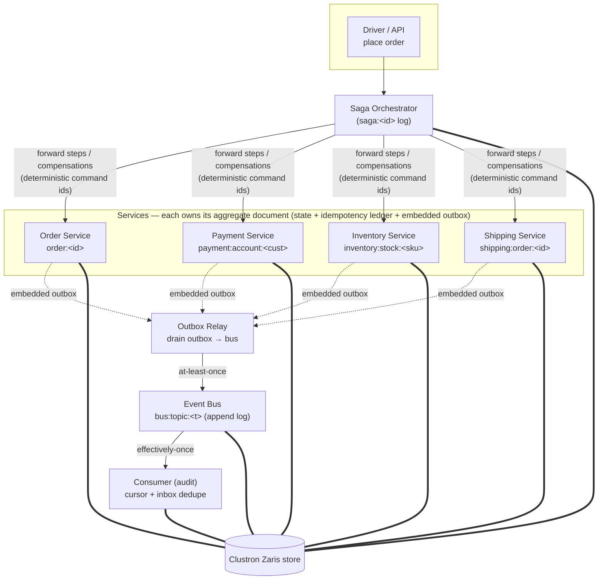
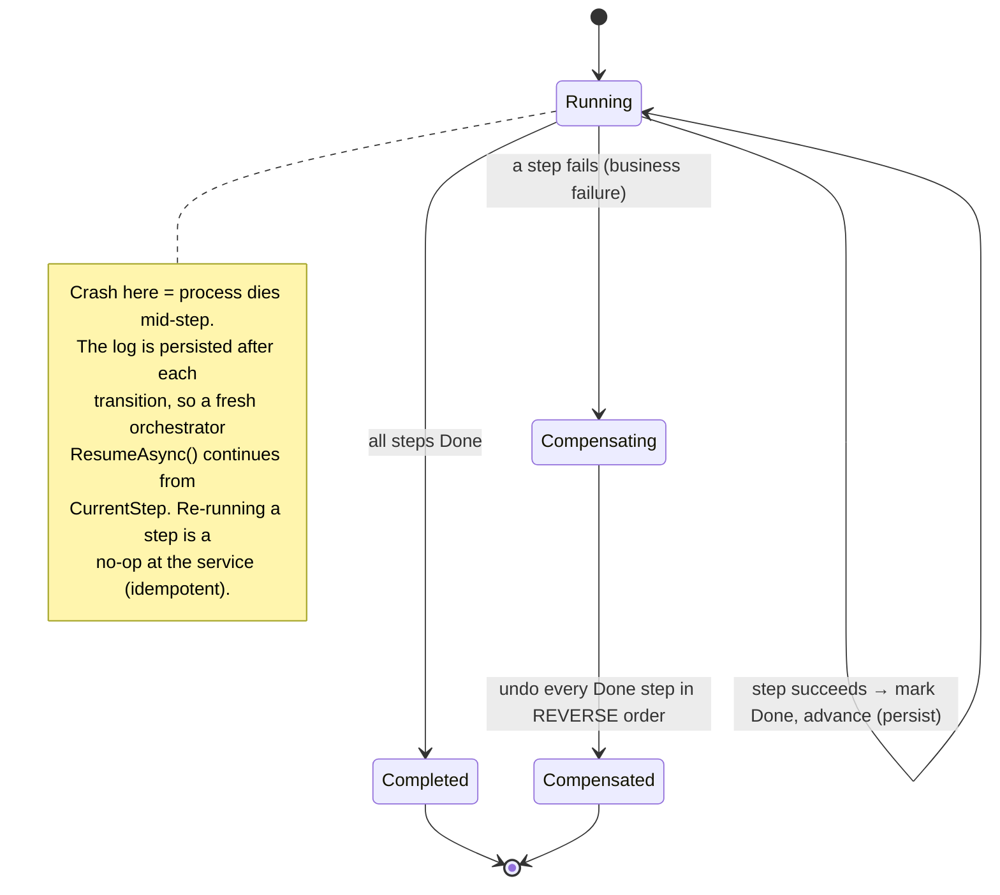
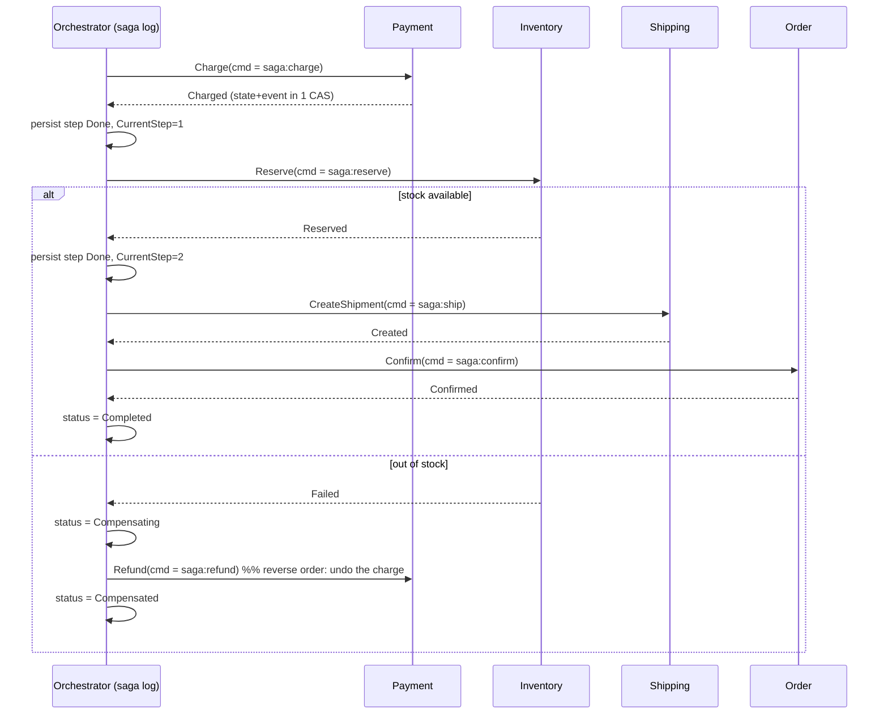

# Reliable Distributed Transactions on Clustron Zaris — Saga Orchestrator + Transactional Outbox

A real, runnable solution to the hardest problem in microservices: **doing a multi-service business
transaction reliably when there is no distributed transaction to lean on.** It implements, on top of
a [Clustron Zaris](https://clustron.io) in-memory store:

- a **saga orchestrator** that drives an *order → payment → inventory → shipping* flow across four
  services, with **compensating transactions** on failure, **idempotent steps**, and **crash
  recovery** (a restarted orchestrator resumes from its persisted log and finishes or unwinds the
  saga correctly), and
- a **transactional outbox** in every service, so each state change and the event announcing it are
  committed **atomically** (no dual-write), relayed **at-least-once**, and applied by consumers
  **effectively-once** via an inbox dedupe set.

Everything runs in a single process against an **embedded** Zaris engine — no cluster, no ports, no
setup — yet uses the *real* Zaris client and the *real* compare-and-swap path, so it behaves
identically against a networked cluster (change one connection string).

```powershell
dotnet test                              # 24 passing
dotnet run --project src/SagaOutbox.Demo # happy path + compensation + crash-recovery + dedupe
./run-demo.ps1                           # same, Release build (captured output in docs/demo-output.txt)
```

---

## 1. The problem

A single customer action — "place this order" — must cause several independent things to happen,
each owned by a different service with its own storage:

1. **Payment** charges the customer.
2. **Inventory** reserves stock.
3. **Shipping** creates a shipment.
4. **Order** is confirmed.

There is **no two-phase commit** across these services. Two failure modes bite immediately:

### 1a. The dual-write problem

A service must both **change its state** and **tell the world** it changed (publish an event the
other services/consumers react to). If those are two separate writes — update the database, then
publish to a broker — a crash *between* them is unrecoverable:

- state committed but event lost → the rest of the system never learns; money moved silently, or
- event published but state rolled back → consumers act on something that never happened.

You cannot make "write my state" and "publish my event" atomic if they live in two different systems.

### 1b. Partial failure of a multi-step transaction

Step 3 can fail after steps 1–2 already committed. Without a rollback mechanism the customer is
charged for an order that can't ship, and stock is reserved forever. And the thing *coordinating*
the steps can itself crash halfway, leaving the transaction in limbo with no record of how far it got.

This solution addresses **1a** with a **transactional outbox** and **1b** with a **saga orchestrator**,
both built on one primitive Zaris gives us: **optimistic, versioned compare-and-swap on a single
document.**

---

## 2. The one primitive: versioned CAS on a single document

Zaris's .NET client exposes `GetAsync<T>` (which returns the value *and* a monotonic `Version`) and
`PutAsync(..., PutOptions{ IfMatchVersion = v })` / `PutOptions{ IfAbsent = true }`. A write that
names a stale version is rejected with `KvStatus.Conflict`. There is **no** server-side atomic
increment and we do **not** rely on cross-key transactions; instead:

> A **single Zaris document** is our atomic unit. Anything written into one document is committed in
> one all-or-nothing CAS. So if we **co-locate** a service's business state, its idempotency ledger,
> and its outbox events in *one document*, then "change state + record the event + remember the
> command" is **one atomic write** — and the dual-write problem simply cannot occur.

`ZarisDocumentStore.MutateAsync` wraps this as an atomic read-modify-write with bounded retry:

```csharp
await store.MutateAsync<Account>(key,
    acct => {                       // runs against freshly-read, committed state every attempt
        if (acct.AlreadyProcessed(cmd)) return null;   // idempotent no-op → no write
        acct.BalanceCents -= amount;                   // 1. business state
        acct.MarkProcessed(cmd);                       // 2. idempotency ledger
        acct.Emit("PaymentCharged", …);                // 3. outbox event  — all three in ONE CAS
        return acct;
    },
    create: () => new Account(…));  // CAS Conflict → re-read, re-run the lambda
```

> **Streams / pub-sub?** A stream would be a natural home for an outbox. We checked the client
> surface in `clustron-zaris-dev/src/Clustron.Zaris`: the native `IZarisClient` exposes
> Put/Get/Delete + CAS, bulk, batch, TTL and transactions, but **no native stream or pub-sub API**
> (those exist only on the RESP front-end, not the native client). So, exactly as the brief directs,
> the event log and the embedded outboxes are built from **CAS'd documents** (an append-only list
> document for the bus; an embedded event array for each aggregate).

---

## 3. Architecture

Four services, an orchestrator, a relay and a consumer — all over one Zaris store (distinct key
prefixes). In the demo/tests they share one embedded engine; in production each would be its own
process pointed at the same cluster.



### Saga state machine



### Happy-path sequence (and where compensation branches in)



---

## 4. How Zaris is used (keys, versions, idempotency)

| Key pattern | Document | Written by | Notes |
|---|---|---|---|
| `order:<orderId>` | `Order` (state + ledger + outbox) | Order service | |
| `payment:account:<customerId>` | `Account` (balance + charge ledger + outbox) | Payment service | |
| `inventory:stock:<sku>` | `Stock` (available/reserved + reservation ledger + outbox) | Inventory service | |
| `shipping:order:<orderId>` | `Shipment` (status + outbox) | Shipping service | |
| `saga:<sagaId>` | `SagaDocument` (status, CurrentStep, per-step log) | Orchestrator | persisted after every transition |
| `bus:topic:<topic>` | `BusLog` (NextSeq + append-only `Records`) | Relay | the event bus |
| `bus:cursor:<topic>:<consumer>` | `ConsumerState` (cursor + processed-id inbox) | Consumer | cursor + inbox in one CAS |
| `outbox:registry:<service>` | `RegistrySet` (aggregate keys) | Services | relay discovery (see note) |

**Atomicity (dual-write solved).** Every service mutation goes through `MutateAsync`, so the business
field change, the `ProcessedCommands` ledger entry and the appended `OutboxEvent` land in the *same*
document in the *same* CAS. `OutboxAtomicityTests` asserts the document's version advances by exactly
one per operation, and that 40 concurrent charges lose neither a debit nor an event.

**Idempotency.** Each aggregate keeps the set of command ids it has applied. A repeated command (saga
retry after a crash, or a redelivered message) is detected and becomes a no-op that returns the prior
result. The saga derives every command id deterministically from the saga id (`"<sagaId>:charge"`,
`"<sagaId>:reserve"`, …), so re-executing a step after a crash hits the same id and cannot double-charge.

**Compare-and-swap correctness.** `ZarisDocumentStoreTests` drives the raw primitive: a stale
`IfMatchVersion` is rejected; 50 concurrent `MutateAsync` increments all land (no lost updates); a
`null` return is a true no-op that does not bump the version.

**At-least-once + effectively-once.** The relay publishes an outbox event to the bus, *then* flips its
`dispatched` flag — deliberately **not** atomic. A crash in between re-delivers the event next cycle
(a duplicate on the bus). The `BusConsumer` keeps a cursor **and** an inbox set of processed event
ids, advanced together in one CAS, so each event id fires the handler **exactly once** regardless of
duplicates.

> **Relay discovery note.** Because the native client has no key-prefix *scan*, the relay can't
> enumerate an aggregate keyspace on its own, so each service records its aggregate keys in a small
> `outbox:registry:<service>` set and the relay polls those. This is only *discovery* metadata — the
> events themselves always live inside the aggregate document, co-committed with state — so a missed
> registry entry can only *delay* a relay, never lose an event. A production deployment would swap
> this for a prefix scan.

---

## 5. Running it

Prerequisites: .NET SDK 8+ (the solution targets `net8.0`; SDK 9/10 build it fine). The Zaris client
NuGets (`Clustron.Zaris.*` and everything else) resolve from nuget.org via `nuget.config`.

```powershell
# from the saga-outbox folder
dotnet test                               # build + run the 24 tests
dotnet run --project src/SagaOutbox.Demo  # run the 4-scenario demo
./run-demo.ps1                            # Release build + demo
```

No ports are opened and no node is started — the store is `zaris://inproc/<name>`, an embedded engine
shared by all connections in the process. To run against a real cluster instead, change the
connection string to `zaris://host:port/<store>`; nothing else changes.

---

## 6. Observed results (evidence)

Full captured output is in [`docs/demo-output.txt`](docs/demo-output.txt). Highlights:

**Scenario 1 — happy path.** Order fulfilled end-to-end; the relay moved all five events to the bus
and the consumer applied each exactly once:
```
end:   alice balance=$70.00, WIDGET available=48 reserved=2, shipment=Created, order=Confirmed
bus records=5; distinct effects applied by consumer=5 (each exactly once ✓)
```

**Scenario 2 — failure + compensation.** Stock short (1 available, 5 wanted). Payment was charged,
then the failed reserve triggered compensation that **refunded** it; nothing left reserved:
```
step done -> ChargePayment      compensated -> ChargePayment
saga result: Compensated  (reason: out of stock for GADGET)
end:   bob balance=$100.00 (refunded), GADGET available=1 reserved=0, order=Pending
payment fully refunded ✓
```

**Scenario 3 — crash mid-saga + recovery.** The orchestrator crashed right after Inventory committed
the reservation but *before* the saga log recorded the step. A fresh orchestrator resumed from the
persisted log and finished — charging once and reserving once despite the crash:
```
after crash: GIZMO available=7 reserved=3 (reservation DID commit), saga step 'ReserveInventory'=Pending (NOT yet logged)
resuming with a fresh orchestrator instance ...
end:   carol balance=$75.00, GIZMO available=7 reserved=3, shipment=Created, order=Confirmed
charged once ($25.00), reserved once (3) despite the crash ✓
```

**Scenario 4 — at-least-once relay, effectively-once consumer.** The relay published then "crashed"
before marking dispatched, so recovery put a **duplicate** of the same event id on the bus; the
consumer's inbox applied the effect **once**:
```
bus gained 2 records for 1 logical event (at-least-once: duplicate on the bus)
consumer applied the duplicated PaymentCharged effect 1 time(s) ✓
```

### Test suite (24, all green)

| Area | File | What it proves |
|---|---|---|
| CAS primitive | `ZarisDocumentStoreTests` | create race, stale-version reject, 50-way concurrent no-loss, no-op write |
| Outbox atomicity | `OutboxAtomicityTests` | state+event in one versioned write; concurrent writers lose nothing |
| Relay + consumer | `RelayAndConsumerTests` | drain+mark, crash→at-least-once redelivery, inbox dedupe, cursor resume |
| Service idempotency | `ServiceIdempotencyTests` | double-charge/reserve applied once; decline; refund restore + idempotent |
| Saga | `SagaOrchestratorTests` | happy path, compensation, **reverse-order** compensation, crash-resume, completed no-op |
| End-to-end | `EndToEndIntegrationTests` | full 4-service flow; crash+resume → exactly-once effects + consumer dedupe |

---

## 7. Project layout

```
saga-outbox/
├─ src/SagaOutbox.Core/
│  ├─ Infrastructure/  ZarisConnection, ZarisDocumentStore (the CAS primitive)
│  ├─ Outbox/          OutboxEvent, EventBus, OutboxRelay, BusConsumer, OutboxRegistry
│  ├─ Services/        OutboxAggregate + Order/Payment/Inventory/Shipping services
│  └─ Saga/            SagaDocument, OrderFulfillmentSaga (orchestrator)
├─ src/SagaOutbox.Demo/  Program.cs — the 4-scenario driver
├─ tests/SagaOutbox.Tests/  xUnit; each test gets its own isolated in-proc store
└─ docs/demo-output.txt     captured evidence
```

## 8. Design notes & honest limitations

- **In-memory store.** Zaris is an in-memory store (optionally replicated); this solution's durability
  is as durable as the store/cluster it points at. The saga log and outbox patterns are identical to
  how you'd use a durable DB — the point here is the *protocol*, not the storage medium.
- **Append-log bus grows unbounded**, as does a consumer's inbox set, in this demo. Production would
  trim delivered records / compact the inbox by low-water-mark, or use a real stream.
- **Relay runs on demand** in the demo/tests (so results are deterministic). In production it would be
  a background loop per service.
- **Single-document scope.** Atomicity holds within one aggregate document. Cross-aggregate
  consistency is exactly what the saga provides — eventual, via compensation — which is the correct
  model for microservices.
```
